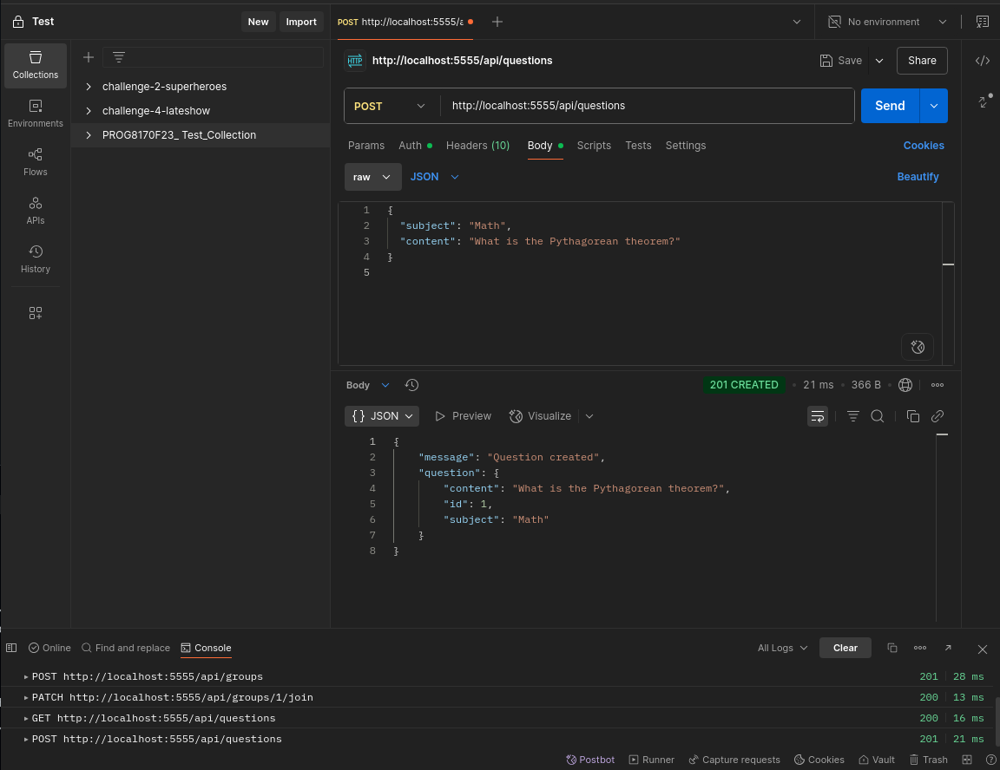

# JuaShule Project Documentation

## Overview
This document outlines the steps taken to set up the PostgreSQL database, configure the Flask application, perform database migrations, and test the API endpoints using Postman for the JuaShule project. The project is developed on a Kali Linux system with Python 3.9.18 in a virtual environment.

---

## 1. Database Setup

### 1.1 Starting PostgreSQL Service
The PostgreSQL service was started to enable database operations.

```bash
(3.9.18) ┌──(david㉿kali)-[~/…/code/phase-4/Projects/JuaShule]
└─$ cd server

(3.9.18) ┌──(david㉿kali)-[~/…/phase-4/Projects/JuaShule/server]
└─$ sudo service postgresql start
[sudo] password for david:
```

- **Explanation**: The `cd server` command navigates to the server directory. The `sudo service postgresql start` command initiates the PostgreSQL service, requiring the user's password for administrative privileges.

---

### 1.2 Creating Database and User
A new database and user were created with appropriate privileges.

```bash
(3.9.18) ┌──(david㉿kali)-[~/…/phase-4/Projects/JuaShule/server]
└─$ sudo -u postgres psql
psql (17.5 (Debian 17.5-1))
Type "help" for help.

postgres=# CREATE DATABASE juashule;
CREATE DATABASE
postgres=# CREATE USER juashule_user WITH PASSWORD 'Mchafuziarts189';
CREATE ROLE
postgres=# GRANT ALL PRIVILEGES ON DATABASE juashule TO juashule_user;
GRANT
postgres=# \c juashule
You are now connected to database "juashule" as user "postgres".
juashule=# GRANT ALL ON SCHEMA public TO juashule_user;
GRANT
juashule=# ALTER SCHEMA public OWNER TO juashule_user;
ALTER SCHEMA
juashule=# 
juashule=# 
juashule=# psql -U juashule_user -d juashule
juashule-# 
juashule-# \dn
    List of schemas
  Name  |     Owner     
--------+---------------
 public | juashule_user
(1 row)

juashule-# \q
```

- **Explanation**: 
  - `sudo -u postgres psql` logs into the PostgreSQL server as the `postgres` user.
  - `CREATE DATABASE juashule` creates a new database named `juashule`.
  - `CREATE USER juashule_user WITH PASSWORD 'Mchafuziarts189'` creates a new user with a secure password.
  - `GRANT ALL PRIVILEGES ON DATABASE juashule TO juashule_user` grants full access to the database.
  - `\c juashule` connects to the `juashule` database.
  - `GRANT ALL ON SCHEMA public TO juashule_user` and `ALTER SCHEMA public OWNER TO juashule_user` ensure the user has control over the public schema.
  - `psql -U juashule_user -d juashule` switches to the `juashule_user` and verifies the schema ownership with `\dn`.
  - `\q` exits the PostgreSQL shell.

---

### 1.3 Verifying Schema Ownership
The schema ownership was checked again to confirm the setup.

```bash
(3.9.18) ┌──(david㉿kali)-[~/…/phase-4/Projects/JuaShule/server]
└─$ sudo -u postgres psql
psql (17.5 (Debian 17.5-1))
Type "help" for help.

postgres=# psql -U juashule_user -d juashule
postgres-# \dn
      List of schemas
  Name  |       Owner       
--------+-------------------
 public | pg_database_owner
(1 row)

postgres-# \q
```

- **Explanation**: This step appears to show a discrepancy, where the owner is listed as `pg_database_owner` instead of `juashule_user`. This might be a misconfiguration or a display issue in the context. The earlier `ALTER SCHEMA` command should have set `juashule_user` as the owner, so this could be a typo or an unintended switch back to the `postgres` context. Further verification with `juashule_user` login would clarify this.

---

## 2. Flask Application and Migration Setup

### 2.1 Activating Virtual Environment and Configuring Flask
The virtual environment was activated, and Flask was configured to run on port 5555.

```bash
(3.9.18) ┌──(david㉿kali)-[~/…/code/phase-4/Projects/JuaShule]
└─$ cd server

(3.9.18) ┌──(david㉿kali)-[~/…/phase-4/Projects/JuaShule/server]
└─$ source venv/bin/activate

(3.9.18) ┌──(venv)─(david㉿kali)-[~/…/phase-4/Projects/JuaShule/server]
└─$ export FLASK_APP=app.py
export FLASK_RUN_PORT=5555
```

- **Explanation**: 
  - `source venv/bin/activate` activates the Python virtual environment.
  - `export FLASK_APP=app.py` sets the Flask application entry point.
  - `export FLASK_RUN_PORT=5555` configures Flask to run on port 5555 (though this should be a single `export` command: `export FLASK_RUN_PORT=5555`).

---

### 2.2 Initializing and Performing Database Migrations
The Alembic migration tool was used to manage database schema changes.

```bash
(3.9.18) ┌──(venv)─(david㉿kali)-[~/…/phase-4/Projects/JuaShule/server]
└─$ flask db init
  Creating directory /home/david/Documents/code/phase-4/Projects/JuaShule/server/migrations ...  done
  Creating directory /home/david/Documents/code/phase-4/Projects/JuaShule/server/migrations/versions ...  done
  Generating /home/david/Documents/code/phase-4/Projects/JuaShule/server/migrations/script.py.mako ...  done
  Generating /home/david/Documents/code/phase-4/Projects/JuaShule/server/migrations/env.py ...  done
  Generating /home/david/Documents/code/phase-4/Projects/JuaShule/server/migrations/README ...  done
  Generating /home/david/Documents/code/phase-4/Projects/JuaShule/server/migrations/alembic.ini ...  done
  Please edit configuration/connection/logging settings in /home/david/Documents/code/phase-4/Projects/JuaShule/server/migrations/alembic.ini before proceeding.

(3.9.18) ┌──(venv)─(david㉿kali)-[~/…/phase-4/Projects/JuaShule/server]
└─$ flask db migrate -m "Initial migration"
INFO  [alembic.runtime.migration] Context impl PostgresqlImpl.
INFO  [alembic.runtime.migration] Will assume transactional DDL.
INFO  [alembic.autogenerate.compare] Detected added table 'students'
INFO  [alembic.autogenerate.compare] Detected added table 'groups'
INFO  [alembic.autogenerate.compare] Detected added table 'questions'
INFO  [alembic.autogenerate.compare] Detected added table 'resources'
INFO  [alembic.autogenerate.compare] Detected added table 'group_memberships'
  Generating /home/david/Documents/code/phase-4/Projects/JuaShule/server/migrations/versions/faa0c7e3507b_initial_migration.py ...  done

(3.9.18) ┌──(venv)─(david㉿kali)-[~/…/phase-4/Projects/JuaShule/server]
└─$ flask db upgrade
INFO  [alembic.runtime.migration] Context impl PostgresqlImpl.
INFO  [alembic.runtime.migration] Will assume transactional DDL.
INFO  [alembic.runtime.migration] Running upgrade  -> faa0c7e3507b, Initial migration
```

- **Explanation**: 
  - `flask db init` initializes the migration environment, creating necessary directories and configuration files.
  - `flask db migrate -m "Initial migration"` generates a migration script based on the models (e.g., `students`, `groups`, `questions`, `resources`, `group_memberships`).
  - `flask db upgrade` applies the migration to the database, creating the tables.
---

### 2.3 Verifying Table Creation
The created tables were verified in the database.

```bash
(3.9.18) ┌──(david㉿kali)-[~/…/phase-4/Projects/JuaShule/server]
└─$ sudo -u postgres psql
psql (17.5 (Debian 17.5-1))
Type "help" for help.

postgres=# \c juashule
You are now connected to database "juashule" as user "postgres".
juashule=# 
juashule=# \dt
Did not find any relations.
juashule=# \dt
                 List of relations
 Schema |       Name        | Type  |     Owner     
--------+-------------------+-------+---------------
 public | alembic_version   | table | juashule_user
 public | group_memberships | table | juashule_user
 public | groups            | table | juashule_user
 public | questions         | table | juashule_user
 public | resources         | table | juashule_user
 public | students          | table | juashule_user
(6 rows)

juashule=#
```

- **Explanation**: The initial `\dt` command might have been run before the migration was applied, showing no relations. The second `\dt` confirms the creation of tables (`alembic_version`, `group_memberships`, `groups`, `questions`, `resources`, `students`) owned by `juashule_user`.

---

## 3. API Endpoint Testing with Postman

### 3.1 Signup
- **Action**: Created a new user account.
- **Image**: 
  <div style="margin: 20px 0;">
    
  </div>
- **Explanation**: The POST request to `/api/students` successfully registered a new user, returning a token for authentication.

---

### 3.2 Login
- **Action**: Logged in with user credentials.
- **Image**: 
  <div style="margin: 20px 0;">
    
  </div>
- **Explanation**: The POST request to `/api/login` authenticated the user and returned a token, which is used for subsequent authenticated requests.

---

### 3.3 Auth Request
- **Action**: Verified authenticated request (e.g., `/api/students/me`).
- **Image**: 
  <div style="margin: 20px 0;">
    
  </div>
- **Explanation**: A GET request with the token confirmed the user's details, returning a `200` status with user data.

---

### 3.4 Get All Groups
- **Action**: Retrieved all groups.
- **Image**: 
  <div style="margin: 20px 0;">
    
  </div>
- **Explanation**: A GET request to `/api/groups` returned a list of existing groups, confirming the endpoint's functionality.

---

### 3.5 Create Group
- **Action**: Created a new group.
- **Image**: 
  <div style="margin: 20px 0;">
    
  </div>
- **Explanation**: A POST request to `/api/groups` with group details (name, description) returned a `201` status, indicating successful creation.

---

### 3.6 Join a Group
- **Action**: Joined an existing group.
- **Image**: 
  <div style="margin: 20px 0;">
    
  </div>
- **Explanation**: A PATCH request to `/api/groups/{id}/join` updated the user's membership, returning a `200` status.

---

### 3.7 Get Questions
- **Action**: Retrieved all questions.
- **Image**: 
  <div style="margin: 20px 0;">
    
  </div>
- **Explanation**: A GET request to `/api/questions` returned a list of questions, verifying the endpoint.

---

### 3.8 Create Question
- **Action**: Created a new question.
- **Image**: 
  <div style="margin: 20px 0;">
    
  </div>
- **Explanation**: A POST request to `/api/questions` with subject and content returned a `201` status, indicating success.

---

### 3.9 Update Question (Unauthorized Error)
- **Action**: Attempted to update a question.
- **Image**: 
  <div style="margin: 20px 0;">
    
  </div>
- **Explanation**: A PATCH or PUT request to `/api/questions/{id}` resulted in a `401 Unauthorized` error, likely due to missing or invalid authentication.

---

### 3.10 Delete Question (Unauthorized Error)
- **Action**: Attempted to delete a question.
- **Image**: 
  <div style="margin: 20px 0;">
    
  </div>
- **Explanation**: A DELETE request to `/api/questions/{id}` also returned a `401 Unauthorized` error, indicating the need for proper JWT authentication or user permissions.

---
